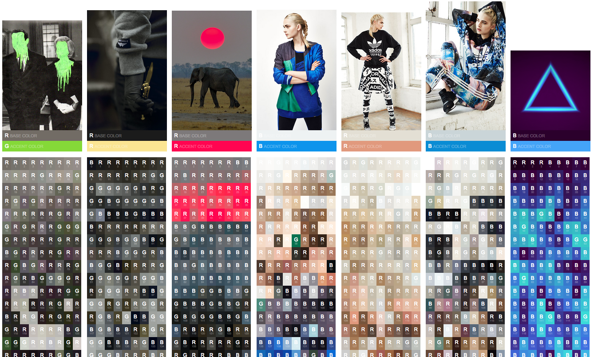

# colorbox

A toolbox for zeroing in on types of color in an image. Primarily developed to snatch interesting colors from album art to send to Hue lights.

---

### Setup on macOS

- [Install ImageMagick](https://github.com/elad/node-imagemagick-native/issues/161#issuecomment-304498227)
- `npm install`

---

### Debugging environment

Since so much of the tweaking of this tool is visual, I setup a debugging environment with a basic HTML output and gulp/browser-sync to be able to see changes visually as you save.

Start the debugger with `npm start`, and you should see something that looks like this:

